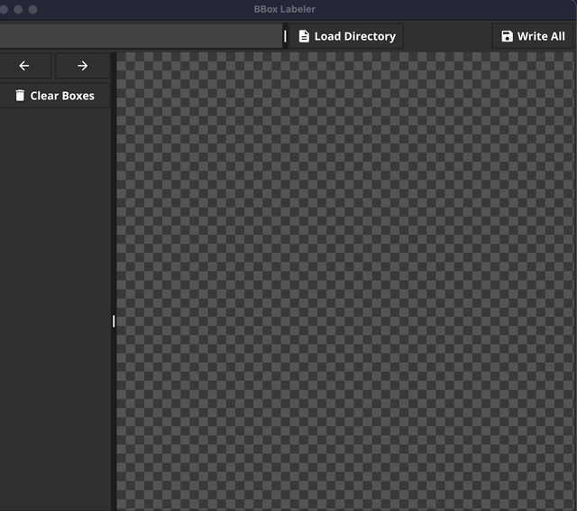

# bounding box labeler

A bounding box labeler/annotator built in Go. Can be cross compiled to any platform. 
Current releases are for Windows/Mac set under the v0.0.0-rc release tag.

Annotations get stored under the same directoy under the filename default.box

